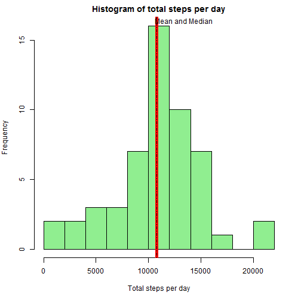
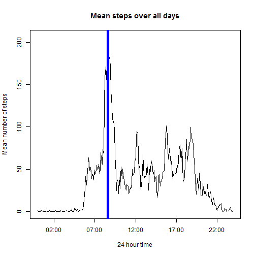
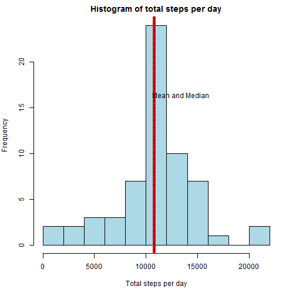
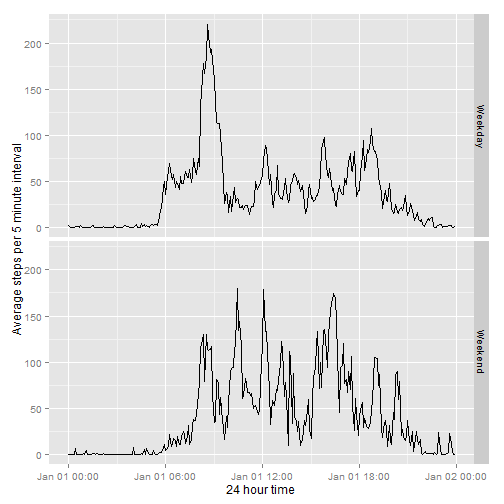

Project 1 Assignment involves analysis of personal movement data from an activity monitoring device. 
The variables included in this dataset are:

-**steps:** Number of steps taking in a 5-minute interval (missing values are coded as NA)

-**date:** The date on which the measurement was taken in YYYY-MM-DD format

-**interval:** Identifier for the 5-minute interval in which measurement was taken

##Loading and preprocessing the data
The first code chunk loads the libraries and data and preprocesses in to a form suitable for analysis


```r
activity <- read.csv("activity.csv")
library(lubridate)
library(stringr)
library(ggplot2)
library(dplyr)
library(lattice)
activity$comp <- complete.cases(activity)
activity$date2 <- strptime(activity$date, "%d/%m/%Y")
activity$date_c <- strftime(activity$date2, "%Y/%m/%d")
activity$hm <- str_pad(as.character(activity$interval),4,pad="0")
test <-strsplit(activity$hm, '(?<=.{2})', perl=TRUE) 
# http://stackoverflow.com/questions/11619616/how-to-split-a-string-into-substrings-of-a-given-length
test2 <-data.frame(t(sapply(test,c))) 
#http://stackoverflow.com/posts/4227504/edit
activity$time <- paste(test2$X1,test2$X2,sep=":")
```

##What is mean total number of steps taken per day?
1. Calculate the total number of steps taken per day


```r
steps_day <- aggregate(steps~date_c, data=activity, sum)
```

2. Construct a histogram of the total number of steps taken each day showing the mean and median

```r
par(mar= c(5,4,2,2))
hist(steps_day$steps, breaks = 9, xlab="Total steps per day",
     main = "Histogram of total steps per day",col="light green")
meansteps = format(mean(steps_day$steps),digits = 7)
mediansteps = format(median(steps_day$steps),digits = 7)
abline(v=meansteps,col="red",lwd=5)
abline(v=mediansteps,lty=4)
text(10000, 16.35,"Mean and Median", pos=4, offset = 0.75)
```

 

The mean number of steps per day is 10766.19.  
The mean number of steps per day is 10765.

## What is the average daily activity pattern?
1. Time series plot of average number of steps over all days for each 5 minute interval

```r
steps_mean <- aggregate(steps~time, data=activity,mean)
steps_mean$timet <- parse_date_time(steps_mean$time, "%H%M")

plot(steps_mean$timet,steps_mean$steps,type="l", main="Mean steps over all days",
     xlab = "24 hour time", ylab = "Mean number of steps")
maxsteps <-max(steps_mean$steps)
maxtime <- steps_mean[steps_mean$steps==maxsteps,1]
x1 <- steps_mean[steps_mean$steps==max(steps_mean$steps),3]
abline(v=x1,lwd=5,col="blue")
```

 

2. The 5 minute interval with the maximum number of steps commences at 08:35 with an average of 206.1698113 steps.

## Imputing missing values

```r
incomp <- activity[activity$comp==FALSE,]
comp <- activity[activity$comp == TRUE,]
incompcount <- nrow(incomp)
```

1. The total number of missing values (steps = NA) in the dataset is 2304

2. The strategy chosen for imputing missing values is to use the average number of steps per 5 minute interval for each of the 8 days with missing values.

3. Create a new dataset that is equal to the original dataset but with the missing data filled in.


```r
rep_steps_mean <-do.call("rbind", replicate(8, steps_mean, simplify = FALSE))
# http://stackoverflow.com/questions/8753531/repeat-data-frame-n-times
for (i in 1:nrow(incomp)){
    incomp$steps[i] <- rep_steps_mean$steps[i]
}
imputed_all <- rbind(comp,incomp) # this is the new dataset
```

4. Revised histogram

```r
par(mar= c(5,4,2,2))
steps_day1 <- aggregate(steps~date_c, data=imputed_all, sum)
hist(steps_day1$steps, breaks = 9, xlab="Total steps per day",
     main = "Histogram of total steps per day",col="light blue")
meansteps1 = format(mean(steps_day1$steps),digits = 7)
mediansteps1 = format(median(steps_day1$steps),digits = 7)
abline(v=meansteps1,col="red",lwd=5)
abline(v=mediansteps1,lty=4)
text(10000, 16.35,"Mean and Median", pos=4, offset = 0.75)
```

 

The mean of the revised dataset is 10766.19 steps and the median is 10766.19 steps. 
This is no different to the mean calculated without imputed data with 10766.19 steps.

## Are there differences in activity patterns between weekdays and weekends?
1. Create a new factor variable to identify weekday vs weekend.

```r
imputed_all$week_data <- wday(imputed_all$date2)
imputed_all$week_data[which(imputed_all$week_data==1|imputed_all$week_data==0)] <- "Weekend"
imputed_all$week_data[which(imputed_all$week_data!="Weekend")] <- "Weekday"
```

2. Make a panel plot to show comparisons between weekdays and weekends, incorporating the imputed data.

```r
steps_mean1 <- aggregate(imputed_all$steps, by = list(imputed_all$week_data,imputed_all$time), data=imputed_all,mean)
steps_mean1$timet <- parse_date_time(steps_mean1$Group.2, "%H%M")
qplot(timet, x, data = steps_mean1, facets = Group.1~., geom = "line",
      xlab = "24 hour time", ylab  = "Average steps per 5 minute interval")
```

 

The plots show that activity on weekdays is concentrated around 8 to 9 am whereas on weekends it is more spread throughout the day.
